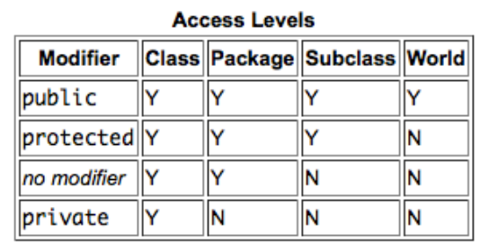

# Wykład 2 - Klasy, Interfejsy, itp.

### Klasy

Chyba nie muszę tłumaczyć jak działają podstawowe działania na klasach, po publicznych klasach możemy tworzyć obiekty tych klas itd.

Mamy w Javie cztery typy jak możemy deklarować zmienne, klasy, interfejsy itd:  
__public__ - dostępny wszędzie  
__protected__ - dostępny tylko w danej klasie, klasach potomnych i klasach z tego samego pakietu  
`bezNiczego` - dostępny tylko w danej klasie i klasach z tego samego pakietu  
__private__ - dostępny tylko dla metod danej klasy

Konstruktor jest automatycznie generowany, nawet kiedy go nie ma, może nie mieć w środku nic, może być ich nieskończoność.
  

Uruchomiamy program wpisując w terminal podaną komende: `java pakiet.podpakiet.Klasa`, gdzie `Klasa.class` musi sie znajdować w podkatalogu `./pakiet/podpakiet/`  

### Pakiety

Klasy można grupować w pakiety. Nazwa pakietu, do którego
należy klasa jest podana w pliku definiującym klasę:
`package pakiet.podpakiet;`
Jeśli chcemy użyć klasy z innego pakietu niż nasz, musimy ją
uprzednio zaimportować:
`import pakiet.podpakiet.Klasa;`
lub
`import pakiet.podpakiet.*;`
hierarchia pakietów jest odwzorowana w systemie plików
w hierarchie katalogów.

### Klasy - konwencje:
nazwa pakietu: z małej litery,  
nazwa klasy: z DUŻEJ litery,  
nazwa atrybutu: z małej litery, 
nazwa metody: z małej litery, 
nazwa zmiennej: z małej litery, stosujemy przedrostki
określające typ zmiennych, np. iValue, sName. 
nazwy pakietów – odwrotne nazwy domenowe, np.
pl.edu.uj.fais.java.wyklad2 

### Zmienne i metody statyczne

Co to jest ten `static`? Słowo kluczowe static sprawia, że dane pole będzie przypisane do klasy, a nie do danej instancji tej klasy, a więc do obiektu tej klasy.
Może to być przydatne na przykład w sytuacji, gdy wiemy i chcemy zrobić tak, żeby wszystkie obiekty danej klasy miały jakąś część wspólną. Taką częścią może być właśnie jakaś wartość pola statycznego.
Metody statyczne nie mogą więc bezpośrednio wywoływać zwykłych metod lub korzystać ze zwykłych atrybutów, gdyż one
są określone wyłącznie w kontekscie obiektów. Atrybuty statyczne są inicjalizowane bezpośrednio po załadowaniu
klasy przez JVM.
Atrybuty zwykłe (niestatyczne) są inicjowane w momencie utworzenia
obiektu (wywołania konstruktora). Zadeklarowane a niezainicjowane
atrybuty są ustawiane na `0` lub `null`.

### Klasy abstrakcyjne

Klasa abstrakcyjna to zwykle klasa, której co najmniej jedna z metod
jest abstrakcyjna. Nie można bezpośrednio tworzyć instancji klasy
abstrakcyjnej. Inaczej można zapisać to tak:  
`public abstract int doSomething();`  
`public int somethingElse() {
}`

### Dziedziczenie
Klasa może mieć tylko jednego, bezpośredniego rodzica (inaczej niż w
C++). Jeśli klasa nie posiada rodzica, dziedziczy automatycznie po
klasie Object (java.lang.Object). W związku z tym instancja dowolnej
klasy jest obiektem (instancją klasy Object).

### Interfejsy

Działąją podobnie do klas abstrakcyjnych, ich zaletą jest to że klasa potomna może implementować wiele interfejsów, co pozwala aby klasa potomna mogła w miare potrzeby rozszerzać inną klase. W środku interfejs zawiera jedynie stałe i deklaracje metod. Od Javy 8 mogą zawierać także metody default i metody statyczne (które mogą zawierać implementację). A od Javy 9 też metody prywatne.

### Javadoc

Można powiedzieć, że to prawie automatyczne stworzenie pliku README dla twojego kodu.
Przetwarza ono specjalne komentarze umieszczone w kodzie na strony www, automatycznie dołączając informacje o nazwach komentowanych klas, metod itd.
Komentarze, które mają zostać przetworzone przez javadoc muszą zaczynać się znakami: `/**`, a kończyć `*/`. W komentarzu możemy umieścić dowolny kod html, który zostanie bez zmian przeniesiony do wygenerowanej dokumentacji. Dodatkowo, javadoc rozpoznaje znaczniki dokumentacyjne, rozpoczynające się od znaku `@` takie jak `@author`, `@version`, `@param`, `@return` czy `@throws`.
Komentować możemy klasy, metody oraz zmienne.  
By wygenerować dokumentację trzeba w terminalu wpisać:

Generowanie dokumentacji:
`javadoc [opcje] nazwa_pakietu`
lub
`javadoc [opcje] nazwa_pliku.java`  
np. `javadoc TryAndCheck.java`

