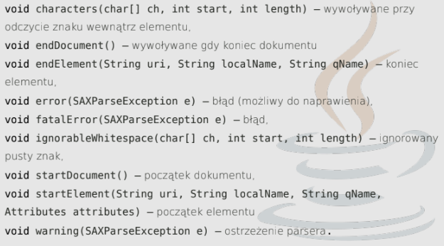
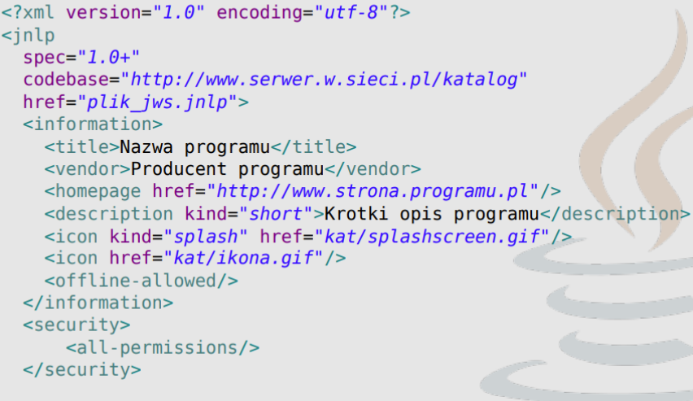

# Pytania na egzamin z języka Java

### 1. Metody rozpoczęcia wątku, co robi metoda start() a co run()

Istnieją dwa podstawowe sposoby tworzenia wątków. Pierwszy z nich polega na rozszerzeniu klasy `java.lang.Thread`. Drugi opiera się na skonstruowaniu wątku w oparciu o klasę implementującą interfejs `java.lang.Runnable` - ten przypadek jest ogólniejszy gdyż klasa implementująca wątek może rozszerzać inną klasę.

__start()__ - tworzy nowy wątek i wywołuje w nim metodę run(); start() w wątku można wywołać tylko raz, w przeciwnym razie generuje `IllegalStateException`

__run()__ - tylko wywołuje metodę w bieżącym wątku

### 2. Pola stytyczne. ogólne słowo kluczowe static i kiedy można zmienić wartość zmiennej statycznej

Słowo `static` jako przeciwieństwo 'dynamiczny' można w uproszczeniu rozumieć w ten sposób, że opisany nim byt do życia nie potrzebuje obiektów.

Jeśli __pole klasy__ zostanie oznaczone jako `static` oznacza to, że jest współdzielone przez wsyztskie obiekty danej klasy. Można uzyskać do niego dostęp odwołując się do nazwy obiektu lub do nazwy klasy - efekt będzie ten sam. Pamięć jest przydzielana tylko raz, podczas ładowania klasy.

__Wartość zmiennej static__ można ustawić ręcznie przy deklaracji, w bloku static, ale również w konstruktorze. Wtedy przy każdorazowym tworzeniu instancji danej klasy, będzie ustawiana/inkrementowana wartość takiej zmiennej.

### 3. Co oznacza `?` w typach generycznych

Oznacza to nieznany typ, reprezentuje __Wildcard__ czyli symbol wieloznaczny.

Może być on używany w wielu przypadkach. Jako typ parametru, pola lub zmiennej lokalnej, czasami jako typ `return`

### 4. Opisać Socket i ServerSocket, co się dzieje gdy nie ma żadnego klienta chcącego się podłączyć metodą `accept()`?

__Socket__ - klasa reprezentująca gniazdo służące do nawiązywania połączenia, wysyłania i odbierania danych

__ServerSocket__ - klasa reprezentująca gniazdo oczekujące na przychodzące żądania połączeń

Gdy używamy `accpet()` i nie ma żadnego klienta chcącego się połączyć to serwer będzie nieustannie czekał na połączenie z klientem.

### 5. Porównać DOM i SAX, co jest lepsze?

__DOM__ to skrót od Document Object Model. Udostępnia on klasy do odczytu i zapisu pliku XML. Dom czyta cały dokument. Jest to przydatne podczas czytania małych i średnich plików XML. Jest to parser oparty na drzewie i troche powolny w porównaniu do SAX i zajmuje więcej miejsca po załadowaniu do pamięciu. __SAX__ jest jednokierunkowy.

### 6. Co to jest DefaulHandler?

defaultHandler to interfejs, który jest implementowany przez klasę, która chce obsługiwać standardowe zdarzenia generowane przez parser SAX (Simple API for XML). Klasa ta musi zaimplementować kilka metod, które będą wywoływane przez parser w trakcie przetwarzania pliku XML. Metody te pozwalają na reagowanie na różne zdarzenia, takie jak początek i koniec elementów, atrybuty elementów itp.

Przykład:


````javascript
import org.xml.sax.helpers.DefaultHandler;

public class MySAXHandler extends DefaultHandler {
// tutaj implementujemy interesujące nas metody
}
````
Następnie możemy użyć obiektu tej klasy jako handlera dla parsera SAX:


````javascript
SAXParserFactory factory = SAXParserFactory.newInstance();
SAXParser parser = factory.newSAXParser();

MySAXHandler handler = new MySAXHandler();
parser.parse(new File("plik.xml"), handler);
````
Przykładowe metody DefaultHandlera:


### 7. Klasa abstrakcyjna, Interfejs

__Klasa abstrakcyjna__ to zwykle klasa. której co najmniej jedna z metod jest abstrakcyjna. Nie można bezpośrednio tworzyć instancji klasy abstrakcyjnej. Klasa może mieć tylko jednego, bezpośredniego rodzica. Jeśli klasa nie posiada rodzica, dziedziczy automatycznie po klasie Object. W związku z tym instancja dowolnej klasy jest obiektem.

__Interfejsy__ to typy, które są podobne do klas, ale mogą zaiwrać jedynie stałe i deklaracje metod. Służą one do definiowania zachowania dla obiektów. Każda klasa implementująca interfejs musi mieć implementację metod zawartych w tym interfejsie. Interfejs może mieć atrybut statyczny, nie dziedziczą po niczym, nawet klasie Object.

### 8. Jakie są pola tekstowe? Jak chcemy, żeby do pola tekstowego można było wprowadzić tylko cyfry, a inne znaki były 0, co musimy zrobic?

### 9. Co to jest JNLP, z czym jest związany, czy pobiera runtime Javy, czy plik uruchamia się na serwerze czy kliencie?

__JNLP__ - Java Network Launching Protocol, jest związany z JWS - Java Web Start

Aktualizuje jedynie runtime Javy, plik uruchamia się na kliencie.


### 10. Co to ResultSet, jak dostać wartości, jak dostać więcej wartości, co zwraca next?

Wyniki zwrócone w wyniku wykonania zapytania __SQL__ są dostępne poprzez obiekt typu `ResultSet`,

```javascript
Statement stmt = con.createStatement(ResultSet.TYPE_SCROLL_INSENSITIVE,
ResultSet.CONCUR_UPDATABLE);
ResultSet resultSet = stmt.executeQuery("SELECT a, b FROM TABLE2");
while(resultSet.next()) {
    double db = resultSet.getDouble();
    int it = resultSet.getInt();
    String str = resultSet.getString();
}
```
`next` zwraca `true` lub `false`

### 11. Co to są wyjątki, RuntimeException, co można z nimi zrobić?

Wyjątki to inaczej błędy programu

Wśród wyjątków znajduje się jedna szczególna klasa: `RuntimeException`, określająca błędy pojawiające się w trakcie działania programu, których nie można było łatwo przewidzieć na etapie tworzenia oprogramowania np. `NullPointerException` lub `IndexOutOfBoundsException`

Wyjątki można wyrzucić 'na zewnątrz' przy pomocy `try..catch..finally` lub na początku metody zadeklarować że może zwrócić taki wyjątek `public void jakasMetoda() throws JakisException{}`


