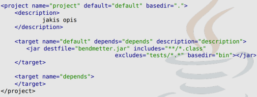

# Pytania na egzamin z języka Java

### 1. Metody rozpoczęcia wątku, co robi metoda start() a co run()

Istnieją dwa podstawowe sposoby tworzenia wątków. Pierwszy z nich polega na rozszerzeniu klasy `java.lang.Thread`. Drugi opiera się na skonstruowaniu wątku w oparciu o klasę implementującą interfejs `java.lang.Runnable` - ten przypadek jest ogólniejszy gdyż klasa implementująca wątek może rozszerzać inną klasę.

__start()__ - tworzy nowy wątek i wywołuje w nim metodę run(); start() w wątku można wywołać tylko raz, w przeciwnym razie generuje `IllegalStateException`

__run()__ - tylko wywołuje metodę w bieżącym wątku

### 2. Pola stytyczne. ogólne słowo kluczowe static i kiedy można zmienić wartość zmiennej statycznej

Słowo `static` jako przeciwieństwo 'dynamiczny' można w uproszczeniu rozumieć w ten sposób, że opisany nim byt do życia nie potrzebuje obiektów.

Jeśli __pole klasy__ zostanie oznaczone jako `static` oznacza to, że jest współdzielone przez wsyztskie obiekty danej klasy. Można uzyskać do niego dostęp odwołując się do nazwy obiektu lub do nazwy klasy - efekt będzie ten sam. Pamięć jest przydzielana tylko raz, podczas ładowania klasy.

__Wartość zmiennej static__ można ustawić ręcznie przy deklaracji, w bloku static, ale również w konstruktorze. Wtedy przy każdorazowym tworzeniu instancji danej klasy, będzie ustawiana/inkrementowana wartość takiej zmiennej.

### 3. Co oznacza `?` w typach generycznych

Oznacza to nieznany typ, reprezentuje __Wildcard__ czyli symbol wieloznaczny.

Może być on używany w wielu przypadkach. Jako typ parametru, pola lub zmiennej lokalnej, czasami jako typ `return`

### 4. Opisać Socket i ServerSocket, co się dzieje gdy nie ma żadnego klienta chcącego się podłączyć metodą `accept()`?

__Socket__ - klasa reprezentująca gniazdo służące do nawiązywania połączenia, wysyłania i odbierania danych

__ServerSocket__ - klasa reprezentująca gniazdo oczekujące na przychodzące żądania połączeń

Gdy używamy `accpet()` i nie ma żadnego klienta chcącego się połączyć to serwer będzie nieustannie czekał na połączenie z klientem.

#### jak pisać i czytać z socketów, jak dostać OutputStream i InputStream z socketu?

```javascript
public static Socket socket;
// tworzymy gniazdo i nawiązujemy połączenie z komputerem identyfikowanym przez adres
socket = new Socket(host, port);
InputStream input = socket.getInputStream();
BufferedReader reader = new BufferedReader(new InputStreamReader(input));
output = socket.getOutputStream();
PrintWriter writer = new PrintWriter(output, true);

```

### 5. Porównać DOM i SAX, co jest lepsze?

__DOM__ to skrót od Document Object Model. Udostępnia on klasy do odczytu i zapisu pliku XML. Dom czyta cały dokument. Jest to przydatne podczas czytania małych i średnich plików XML. Jest to parser oparty na drzewie i troche powolny w porównaniu do SAX i zajmuje więcej miejsca po załadowaniu do pamięciu. __SAX__ jest jednokierunkowy.

### 6. Co to jest DefaulHandler?

defaultHandler to interfejs, który jest implementowany przez klasę, która chce obsługiwać standardowe zdarzenia generowane przez parser SAX (Simple API for XML). Klasa ta musi zaimplementować kilka metod, które będą wywoływane przez parser w trakcie przetwarzania pliku XML. Metody te pozwalają na reagowanie na różne zdarzenia, takie jak początek i koniec elementów, atrybuty elementów itp.

Przykład:


````javascript
import org.xml.sax.helpers.DefaultHandler;

public class MySAXHandler extends DefaultHandler {
// tutaj implementujemy interesujące nas metody
}
````
Następnie możemy użyć obiektu tej klasy jako handlera dla parsera SAX:


````javascript
SAXParserFactory factory = SAXParserFactory.newInstance();
SAXParser parser = factory.newSAXParser();

MySAXHandler handler = new MySAXHandler();
parser.parse(new File("plik.xml"), handler);
````
Przykładowe metody DefaultHandlera:


### 7. Klasa abstrakcyjna, Interfejs

__Klasa abstrakcyjna__ to zwykle klasa. której co najmniej jedna z metod jest abstrakcyjna. Nie można bezpośrednio tworzyć instancji klasy abstrakcyjnej. Klasa może mieć tylko jednego, bezpośredniego rodzica. Jeśli klasa nie posiada rodzica, dziedziczy automatycznie po klasie Object. W związku z tym instancja dowolnej klasy jest obiektem.

__Interfejsy__ to typy, które są podobne do klas, ale mogą zaiwrać jedynie stałe i deklaracje metod. Służą one do definiowania zachowania dla obiektów. Każda klasa implementująca interfejs musi mieć implementację metod zawartych w tym interfejsie. Interfejs może mieć atrybut statyczny, nie dziedziczą po niczym, nawet klasie Object.

### 8. Jakie są pola tekstowe? Jak chcemy, żeby do pola tekstowego można było wprowadzić tylko cyfry, a inne znaki były 0, co musimy zrobic?

### 9. Co to jest JNLP, z czym jest związany, czy pobiera runtime Javy, czy plik uruchamia się na serwerze czy kliencie?

__JNLP__ - Java Network Launching Protocol, jest związany z JWS - Java Web Start

Aktualizuje jedynie runtime Javy, plik uruchamia się na kliencie.


### 10. Co to ResultSet, jak dostać wartości, jak dostać więcej wartości, co zwraca next?

Wyniki zwrócone w wyniku wykonania zapytania __SQL__ są dostępne poprzez obiekt typu `ResultSet`,

```javascript
Statement stmt = con.createStatement(ResultSet.TYPE_SCROLL_INSENSITIVE,
ResultSet.CONCUR_UPDATABLE);
ResultSet resultSet = stmt.executeQuery("SELECT a, b FROM TABLE2");
while(resultSet.next()) {
    double db = resultSet.getDouble();
    int it = resultSet.getInt();
    String str = resultSet.getString();
}
```
`next` zwraca `true` lub `false`

### 11. Co to są wyjątki, RuntimeException, co można z nimi zrobić?

Wyjątki to inaczej błędy programu

Wśród wyjątków znajduje się jedna szczególna klasa: `RuntimeException`, określająca błędy pojawiające się w trakcie działania programu, których nie można było łatwo przewidzieć na etapie tworzenia oprogramowania np. `NullPointerException` lub `IndexOutOfBoundsException`

Wyjątki można wyrzucić 'na zewnątrz' przy pomocy `try..catch..finally` lub na początku metody zadeklarować że może zwrócić taki wyjątek `public void jakasMetoda() throws JakisException{}`

### 12. Serializacja strumieniami (Data i Object)

- Strumienie danych: `DataInputStream`, `Data OutputStream`
```javascript
DataOutputStream dos = new DataOutputStream(System.out);
dos.writeDouble(123.12);
dos.writeUTF("Grzegrz\u00f3\u0142ka");
dos.writeInt(12345);
dos.close();
```
- Strumienie obiektowe: `ObjectInputStream`, `ObjextOutputStream`
```javascript
ObjectOutputStream oos = new ObjectOutputStream(System.out);
oos.writeObject("Grzegrz\u00f3\u0142ka");
oos.close();
```
__Serializacja__ - Klasa wspierająca serializację musi implementować interfejs `Serializable`. Jeśli obiekty tej klasy wymagają specjalnego traktowania podczas serializacji należy zaimplementować metody:
```javascript
private void writeObject(java.io.OubjectOutputStream out) throws IOException;

private void readObject(java.io.OubjectInputStream out) throws IOException;
```
Interfejs `Serializable` nie ma nic w środku.

### 13. JAXB - co to jest, do czego służy, co to marshaller i marshall, jka zapisujemy obiekt do pliku i czytamy z pliku?

__JAXB__ (Java Architecture for XML Binding) to standart serializacji XML dla obiektów Javy.

Klasa __Marshaller__ jest odpowiedzialna za zarządzanie procesem serializacji Java Content Trees z powrotem do danych XML.

```javascript
JAXBContext jc = JAXBContext.newInstance("com.acme.foo")
```
Marshalling to a File:
```javascript
Marshaller m = jc.createMarshaller();
OutputStream os = new FileOutputStream( "nosferatu.xml" );
m.marshal(element, os);
```
Unmarshalling from a file:
```javascript
Unmarshaller u = jc.createUnmarshaller();
Object element = u.unmarshal(new File( "foo.xml"));
```

### 14. Typ generyczny i surowy, jakie są różnice?

__Typ surowy__ - typ referencyjny, który jest tworzony przez pobieranie nazwy deklaracji typu ogólnego bez towarzyszącej listy argumentów typu.

Typy surowe kłocą się z założeniami typów generycznych, ponieważ nie pozwalają kompilatorowi na wykrywanie błędów w typach.

__Typy generyczne__ - elementy pozwalające pisać kod programu w Javie bez wskazywania konkretnych typów danych, na których kod będzie operował. Podejście takie pozwala uniknąć powtarzania, kod pisany jest tylko jeden raz, a następnie wykorzystany może zostać dla różnych typów danych.

```javascript
public class Generyk<T> {
    ptivate T t;
    
    void add(T t){
        this.t = t;
    }
    
    T read() {
        return t;       
    }
}
```

### 15. Executory

Executor to interfejs w Javie, który pozwala na uruchomienie zadań (ang. tasks) asynchronicznie w osobnym wątku. Zadania te są reprezentowane przez obiekty implementujące interfejs java.lang.Runnable lub java.util.concurrent.Callable.

Interfejs Executor zapewnia mechanizm do uruchamiania zadań bez konieczności bezpośredniego tworzenia wątków. Dzięki temu możemy uniezależnić nasz kod od sposobu w jaki zadania są uruchamiane i zarządzane. Executor pozwala również na kontrolowanie ilości wątków, które są tworzone i używane do wykonania zadań.

### 16. Pętle w Javie, co robi break, continue?

__while(warunek)__ - jak spełniony jest warunek, zrób coś

__for(zmienna; warunek; zmiana wartości)__

__do{}while(warunek)__ - rób coś dopóki spełniony jest warunek

__for(type var : array)__ - możemy tak przeglądać kolekcje

__continue__ - pomija część kodu i kontunuuje iteracje pętli

__break__ - wychodzi z pętli

Można jeszcze przeglądać kolekcję motodą `Iterator`
```javascript
Iterator it;
it.hasNext()
    .next()
    .remove()
```

### 17. Metody wieloargumentowe

`public void multiArg(typ... args){}`

Kolejność deklaracji ma znaczenie, zmienne wieloargumentowe deklarujemy na końcu.

`args` możemy traktować jako tablice więc możemy użyć na nim pętli `forEach`

### 18. Sposoby łączenia się z bazą danych

Istnieją dwa sposoby nawiązania połączenia:

- za pomocą klasy `DriverManager`: tradycyjna warstwa zarządzająca JDBC pomiędzy użytkownikiem a sterownikiem.
```javascript
String url = "jdbc:odbc:bazadanych";
Connection con = DriverManager.getConnection(url, "login", "haslo");
```

- za pomocą klass `DataSourse` i usługi JNDI(biblioteka dla zasobów(pliki;BD)) - nie warto dla prostych programów ale dla dużych które potrzerbują różnych zasobów.
Ta klasa zawiera informacje identyfikujące i opisujące dane. Współpracuje z technologią Java Naming and Directory Interface, jest tworzony i zarządzany niezależnie od używanej go aplikacji.

Korzystanie ze źródła danych zarejestrowanego w JNDI zapewnia brak bezpośredniego odwołania do sterownika przez aplikację i umożliwia implementację grupowania połączeń oraz rozproszonych transakcji.
```javascript
Context ctx = new InitialContext();
DataSource ds = (DataSource)ctx.lookup("jdbc/MojaDB");
Connection con = ds.getConnection("myLogin", "myPassword");
```

### 19. Co to ResourceBundle, po co jest i jak działa?

Gdy twój program potrzebuje zasobu specyficznego dla ustawień narodowych, na przykład String, twój program może go załadować z pakietu zasobów, który jest odpowiedni dla ustawień narodowych bieżącego użytkownika. W ten sposób
można napisać kod programu, który jest w dużej mierze niezależny od ustawień regionalnych użytkownika, izolując większość informacji specyficznych dla ustawień regionalnych w pakietach zasobów.

Pozwala to na pisanie programów, które mogą być łątwo zlokalizowane lub przetłumaczone na różne języki, obsługujące wiele lokalizacji jednocześnie, mogą być później łatwo modyfikowane w celu obsługi jeszcze większej liczby lokalizacji

Gdy twój program potrzebuje obiektu specyficznego dla ustawień regionalnych, ładuje klasę `ResourceBundle` za pomocą metody `getBundle`:

```javascript
ResourceBundle myResources = ResourceBundle.getBundle("MyResources",
currentLocale);
```

### 20. Co to ANT? Jak wygląda plik konfiguracyjny, czym się różni od Make?

Ant jest narzędziem umożliwiającym automatyzację procesów związanych z budowaniem programów. Jego podstawowe cechy to:

- konfiguracja zadań zapisana w formacie XML,
- wieloplatformowość
- rozszerzalność w oparciu o klasy napisane w Javie

Aby go wykonać wpisujemy w konsoli polecenie `ant`


Głowna różnica Anta a Make'iem jest tak, że Make dotyczy opisywania zależności między plikami i sposobu budowania plików. Ant dotyczy zależności międzi 'zadaniami' i jest bardziej sposobem na sklejanie ze sobą skryptów budujących.

### 21. Wypisać zawartość pliku

```javascript
import java.io.File;
import java.io.FileNotFoundException;
import java.util.Scanner;

public static void main(String[] args) throws FileNotFoundException {
Scanner odczyt = new Scanner(new File("nazwa_pliku.txt"));
    while(odczyt.hasNext()) {
        System.out.println(odczyt.nextLine());
    }
}
```
### 22. JOptionPane, jakie są rodzaje? jak dostać Stringa z showInputDialog?

Klasa __JOptionPane__ z biblioteki Swing może być wykorzystana do szybkiej interakcji:

- wprowadzania danych (metoda showInputDialog())
- wyświetlania komunikatów (metoda showMessageDialog())
- wyświetlania okienek wyboru Tak/Nie, Ok/Anuluj itp (metoda ShowConfirmDialog())

```javascript
import javax.swing.JOptionPane;
String text = (String) JOptionPane.showInputDialog("jakis tekst")
```

### 23. W którym miejscu jest Constant Pool?

__Constant Pool__ to ilość zadeklarowanych elementów potrzebnych do odpalenia kodu z pliku .class

Najpierw jest identyfikator pliku CA FE BA BE, potem wersja wirtualnej maszyny javy, potem jest deklaracja elementów w Constant Poolu, czyli zmienne, metody, klasy itp.

Dostęp do bytecode'u: `javap -v name.class`

### 24. Czym się różni strumień bajtowy od znakowego?

Strumień bajtowy traktuje dane jako zbiór bajtów; reprezentują 'niskopoziomowy' dostęp do danych. Rozszerzają klasy `InputStream` lub `OutputStream`

Strumieć znakowy automatycznie konwertuje dane do Unicode. Rozszerzają klasy `Reader` lub `Writer`

### 25. Wszystko o FileChooser

FileChooser'y zapewniają GUI do nawigacji po systemie plików, a następnie wybranie pliku lub katalogu z listy lub wprowadzenie nazwy pliku lub katalogu.
`JFileChooser chooser = new JFileChooser();`

Można ustawić filter, aby można było wybrać tylko pliki o danym rozszerzeniu"

`FileNameExtensionFilter filter = new FileNameExtensionFilter("JPG & GIF Images", "jpg",
"gif");`

W pierwszym argumencie wpisujemy tekst jaki ma się pokazać użytkownikowi w tym pasku na dole, a potem po przecinku rozszerzenia obsługiwane. Na koniec przekazujemy filtr do choosera: </br>
`chooser.setFileFilter(filter);`

Wyświetlenie okna dialogowego i zwrócenie inta czy użytkownik kliknął ok czy wyszedł bez wybierania

`int returnVal = chooser,showOpenDialog(Component parent);`

Pobieranie pliku jaki wybrał użytkownik: `File plik = chooser.getSelectedFile()`

Pobieranie wielu plików jakie wybrał użytkownik: `File[] pliki = chooser.getSelectedFiles();`

### 26. HSQLDB

Wiodący system relacyjnych baz danych SQL. Jego własności to m.in.: obsługa SQ:'a, obsługa transakcji, zdalnych procedur i funkcji, możliwość dołączania do programów i appletów (działanie w trybie read-only), pamięć tekstowych i binarnych danych ograniczony przez rozmiar pamięci.

__Stand-alone__ - serwer uruchamiany w ramach procesu, w którym nawiązujemy połączenie z bazą

### 27. Jak utworzyć proces?

Proces można stworzyć korzystając z metody Runtime.exec() lub klasy `ProcessBuilder` z pakietu java.lang

Klasa ProcessBuilder pozwala precyzyjniej opkreślić środowisko, w którym działa proces:

```javascript
ProcessBuilder builder = new ProcessBuilder("ls", "-l");
builder.directory(new File("."));
builder.redirectErrorStream(true);
builder.redirectOutput(Redirect.INHERIT);
Process ps;
try{
    ps = builder.start();
    ps.waitFor();
} catch (IOException | InterruptedException e) {
    e.printStachTrace();
}
Sout("Gotowe");
```

### 28. Modyfikatory dostępu:


### 29. Interfejs Cloneable, co o nim wiesz?

Implementacja interfejsu Cloneable informuje, że nasz obiekt wspiera klonowanie. Boazowa metoda `clone` jest zaimplementowana w klasie `Object`

### 30. Czym się różni URL i URLConnection?

__URL__ - Inifer Resource Locator jest podstawową klasą identyfikującą zasoby w internecie
```javascript
URL url = new URL("https://github.com/Tatraa")  // he he
BufferedReader in - new BufferedReader(new InputStreamReader(url.openStream()));
```
__URLConnection__ zawiera metody umożliwiające nawiązanie połączenia z zasobem reprezentowanym przez URL
```javascript
URL url = new URL("https://github.com/Tatraa");
URLConnection con = url.openConnection();
BufferedReader in = new BufferedReader(new InputStreamReader(con.getInputStream()));
```
URLConnection umożliwia także zapis do wskazanego zasobu przez obiekt URL:
```javascript
con.setDoOutput(true);
OutputStreamWriter out = new OutputStreamWriter(con.getOutputStream());
```

### 31. Swing, co robi pack()? Skąd wie o rozmiarze komponentów? czy pack() i setlocationrelativeto(null) to jest to samo co setlocationrelativeto(null) i pack()

`pack()` to metoda klasy `JFrame`, która ustawia rozmiar okna tak, by pomieściło się w nim wszystkie komponenty. Okno jest automatycznie dostosowywane do rozmiarów komponentów, więc nie trzeba ich ręcznie ustawiać.

`setLocationRelativeTo(null)` ustawia położenie okna na środku ekranu. Jeśli użyjesz tej metody po `pack()`, okno będzie wyśrodkowane na ekranie, ale będzie miało rozmiar dostosowany do zawartych w nim komponentów.

Jeśli użyjesz metody `pack()` po `setLocationRelativeTo(null)`, to lewy górny róg okna zostanie ustawiony w środku ekranu, ale rozmiar okna będzie dostosowany do komponentów.

Podsumowując: `pack()` i `setLocationRelativeTo(null)` są różnymi metodami, które wykonują różne czynności. Użycie ich w odwrotnej kolejności niż opisano powyżej może spowodować, że okno będzie miało nieoczekiwane właściwości.

### 32. Co to jest ASM? Napisz strukture pliku .class

__ASM__ to biblioteka która zapewnia prosty interfejs API do dekomponowania, modyfikowania i rekomponowania binarnych klas Java.

Plik __.class__ jest skompilowanym plikiem __.java__ utworzony przez kompilator Java. Zawiera kod bajtowy, który jest binarnym kodem programu wykonywalnym, gdy jest uruchamiany przez wirtualną maszynę Java (JVM)/ Pliki __.class__ można kompilować z plików __.java__ za pomocą komendy `javac`, która jest dołączona do instalacji __JVM__.

W pliku __.class__ dane przechowywane są w formacie __HEX__, aby wyświetlić bytecode wpisz w terminalu: `javap -v moja_klasa.class`

### 33. Javadoc

Narzędzie ułatwiające pisanie dokumentacji kodu, przetwarza specjalne komentarze (/** .... */) na dokumentację w formacie HTML, automatycznie dołączając informacje o nazwach komentowanych klas, metod, zmiennych itd. Javadoc rozpoznaje znaczniki dokumentacyjne, rozpoczynające się od znaku `@` (np.: @author, @param, @return, @throws)

Generowanie raportu można uzyskać wpisując w terminal komendę: `javadoc Klasy.java`

### 34. Blokady i Deadlock

W programach wielowątkowych występuje kilka rodzajów problemów, które mogą powodować niewłaściwe działanie programów:

- __zakleszczenia__ - wątek blokują wzajemnie zasoby potrzebne im do dalszego działania (pięciu filozofów)
- __zagłodzenia__ - jeden wątek przez cały czas blokuje zasób potrzebny innym wątkom.
- __livelock__ - 'odwrotność' deadlocka - wątek reaguje na zachowanie drugiego wątku, które jest reakcją na zachowanie pierwszego wątku

### 35. Statement w bazach danych

Do przesyłania zapytań do bazy danych służą obiekty klasy:

- __Statement__ - typowe pytania (bezparametrowe)
- __PreparedStatement__ - prekompilowane pytania zawierające parametry wejściowe
- __CCallableStatement__ - procedury zapisane w bazie danych

Obiekt __Statement__ tworzy się w ramach nawiązanego wcześniej połączenia:
```javascript
Connection con = DriverManager.getConnection(url, login, pass);
Statement stmt = con.createStatement();
stmt.executeUpdate("INSERT INTO table(name, price) VALUE 'ser', 2.0");
```
W ramach jednego obiektu Statement można wykonać sekwencyjnie kilka zapytań. Po zakończeniu używania obiektu zaleca się wywołanie metody close().

